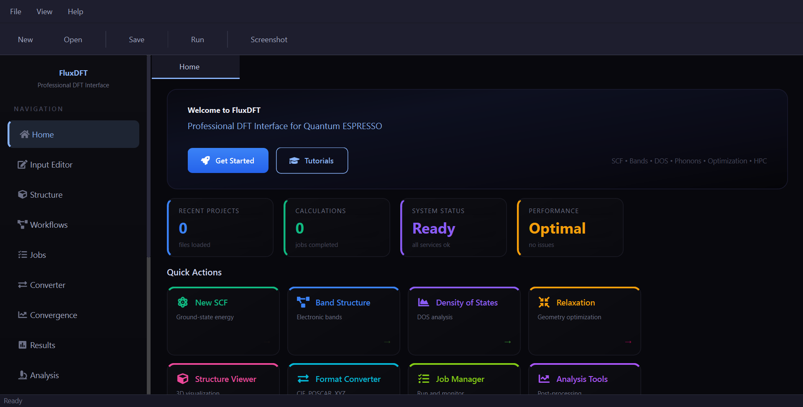
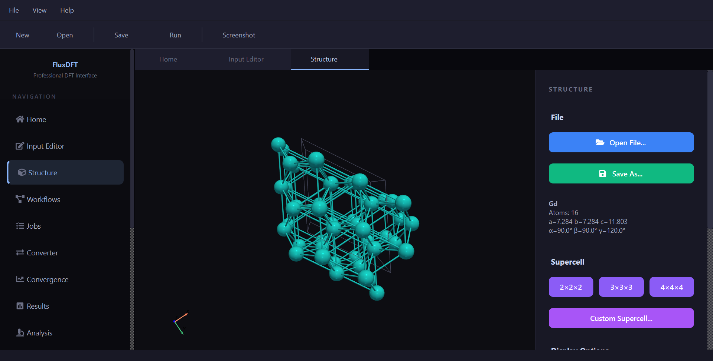

<p align="center">
  
  
  
  
  
</p>

<h1 align="center">⚛️ FluxDFT</h1>

<p align="center">
  <strong>O aplicație desktop modernă și inteligentă care face calculele prin Teoria Funcționalei Densității (DFT) accesibile, eficiente și vizual intuitive.</strong>
</p>

<p align="center">
  <a href="gallery.md"><strong>🖼️ Vezi Galeria de Capturi de Ecran</strong></a>
</p>

<p align="center">
  FluxDFT face legătura între puterea <a href="https://www.quantum-espresso.org/">Quantum ESPRESSO</a> și ușurința unei interfețe grafice moderne.<br/>
  Conceput pentru <strong>cercetători</strong>, <strong>profesori</strong> și <strong>studenți</strong> în fizică computațională și știința materialelor.
</p>




---

## 📋 Cuprins

- [Prezentare generală](#-prezentare-generală)
- [Galerie de capturi de ecran](gallery.md)
- [Funcționalități principale](#-funcționalități-principale)
- [Primii pași](#-primii-pași)
- [Utilizare](#-utilizare)
- [Structura proiectului](#-structura-proiectului)
- [Comenzi rapide de la tastatură](#️-comenzi-rapide-de-la-tastatură)
- [Configurare](#️-configurare)
- [Contribuții](#-contribuții)
- [Licență](#-licență)
- [Mulțumiri](#-mulțumiri)

---

## 🎬 Prezentare generală

FluxDFT oferă un **flux de lucru complet** pentru simulările prin Teoria Funcționalei Densității — de la importul structurii cristaline până la analize gata pentru publicare:

1. **Importați** structuri cristaline din fișiere CIF, XYZ, POSCAR, XSF sau de intrare QE.
2. **Configurați** parametrii de calcul cu validare conștientă de fizică și valori implicite inteligente.
3. **Rulați** calculele local sau pe clustere HPC la distanță prin SSH integrat.
4. **Analizați** rezultatele cu grafice interactive de structură electronică, gata pentru publicare.
5. **Raportați** descoperirile în documente Markdown, HTML sau PDF formatate profesional.

### Pentru cine este FluxDFT?

| Public | Propunere de valoare |
|---|---|
| **Studenți la masterat/doctorat** | Reduceți curba de învățare a Quantum ESPRESSO cu generare ghidată a intrărilor, validare în timp real și explicații bazate pe inteligență artificială. |
| **Cercetători** | Accelerați fluxurile de lucru cu testare automată a convergenței, gestionarea sarcinilor HPC și generare de rapoarte cu un singur clic. |
| **Profesori și educatori** | Utilizați ca instrument didactic cu vizualizare instantanee a conceptelor DFT și vizualizatoare interactive de structuri. |

---

## ✨ Funcționalități principale

### 🧠 Inteligența FluxAI
- **Explicator de fizică** — Solicitați FluxAI să explice parametri DFT complecși și concepte de fizică direct în contextul proiectului dumneavoastră.
- **Analiză a erorilor** — Analiză inteligentă a jurnalelor de erori care identifică cauzele fundamentale și sugerează remedieri specifice.
- **Asistent de metodologie** — Redactare automată a secțiunilor tehnice de metodologie pentru lucrări de cercetare.

### 🧪 Editor inteligent de intrări
- **Validare în timp real** — Evidențiere sintaxă în timp real cu detectarea erorilor conștientă de fizică.
- **Sugestii de corectare automată** — Corectarea cu un singur clic a erorilor frecvente de formatare și de parametri.
- **Valori implicite conștiente de proiect** — Detectarea automată a comportamentului metalic față de izolant pentru recomandarea parametrilor optimi de smearing și lărgire.
- **Recomandare de puncte K** — Sugestii avansate de rețea k bazate pe vectorii rețelei și densitatea țintă.
- **Suport DFT+U** — Configurare ușoară a parametrilor Hubbard U pentru sistemele cu metale de tranziție.
- **Parser schema DEF** — Parsează schema oficială DEF a Quantum ESPRESSO pentru validarea precisă a parametrilor și documentare.

### 🔬 Structură 3D și vizualizare
- **Vizualizator de înaltă fidelitate** — Randare 3D științifică alimentată de [PyVista](https://docs.pyvista.org/) cu materiale PBR (randare bazată pe principii fizice).
- **Generator de supercelule** — Construiți și vizualizați supercelule de orice dimensiune cu previzualizare în timp real.
- **Conversie de formate** — Convertiți fără probleme între CIF, XYZ, POSCAR, XSF și intrare QE folosind [ASE](https://wiki.fysik.dtu.dk/ase/).
- **Monitorizare SCF interactivă** — Monitorizarea convergenței în timp real cu grafice actualizate live.

### ⚙️ Gestionarea sarcinilor și a fluxurilor de lucru
- **Conectivitate HPC** — Client SSH integrat pentru trimiterea sarcinilor pe planificatoarele de clustere **SLURM**, **PBS** și **SGE**.
- **Motor de execuție** — Monitorizați sarcinile locale și la distanță cu streaming de ieșire în timp real.
- **Fluxuri de lucru automatizate** — Conducte dedicate pentru SCF, optimizare geometrică (relax/vc-relax), structura de benzi, DOS și dispersia fononilor.
- **Testare a convergenței** — Studii automate de convergență pentru energia de tăiere și densitatea rețelei de puncte k.
- **Explorer de proiect** — Gestionați fișiere, intrări și rezultate cu un browser de fișiere structurat și intuitiv.

### 📊 Analiza avansată a structurii electronice
- **Structura de benzi** — Generarea traseului k de înaltă simetrie cu detectare automată a simetriei.
- **Densitatea de stări** — DOS total și DOS proiectat (PDOS) cu descompunere orbitală.
- **Benzi grase** — Structura de benzi rezolvată orbital cu ponderarea caracterului atomic.
- **Masă efectivă** — Extracție parabolică și avansată a masei efective la extremele benzilor.
- **Suprafața Fermi** — Vizualizarea 3D a suprafeței Fermi pentru sisteme metalice.
- **Proprietăți optice** — Funcția dielectrică și spectrele de absorbție optică.
- **Grafice compozite** — Grafice alăturate de structură de benzi și DOS pentru publicare.

### 🔊 Analiza fononilor
- **Dispersia fononilor** — Structura de benzi fononice de-a lungul traseelor de înaltă simetrie.
- **DOS fononice** — Densitatea de stări fononice și proprietăți termodinamice.
- **Flux de lucru fononic automatizat** — Conductă completă de la structură la spectrele fononice.

### 🌐 Integrare Materials Project
- **Date de referință** — Comparați rezultatele calculelor dumneavoastră cu datele de referință din [Materials Project API](https://materialsproject.org/).
- **Cache local** — Cache inteligent pentru minimizarea apelurilor API și activarea comparației offline.
- **Import de structuri** — Importați direct structuri cristaline din baza de date Materials Project.

### 📝 Suita de raportare
- **Export în mai multe formate** — Generați rapoarte comprehensive în **PDF**, **HTML** și **Markdown**.
- **Grafice de calitate pentru publicare** — Toate graficele utilizează Matplotlib cu stilizare științifică personalizată, gata pentru trimiterea la reviste.
- **Conținut automat al raportului** — Metodologie pre-populată, tabele de rezultate și legende ale figurilor.

### ☁️ Flux Cloud și experiența utilizatorului
- **Integrare cloud** — Autentificarea utilizatorilor și gestionarea profilului prin [Supabase](https://supabase.com/).
- **Interfață premium** — Temă modernă întunecată cu componente inspirate din glassmorphism și ecran de deschidere animat.
- **Comenzi rapide globale** — Comenzi rapide intuitive de la tastatură cu o suprapunere de comenzi rapide integrată (apăsați `?` pentru a comuta).
- **Notificări desktop** — Alerte de sistem pentru finalizarea sarcinilor și evenimentele critice.

---

## 🚀 Primii pași

### Cerințe preliminare

| Cerință | Versiune | Note |
|---|---|---|
| **Python** | 3.10+ | [Descarcă](https://www.python.org/downloads/) |
| **Quantum ESPRESSO** | 7.0+ | [Ghid de instalare](https://www.quantum-espresso.org/Doc/user_guide/) — trebuie să fie în `$PATH` |
| **Git** | Oricare | Pentru clonarea depozitului |

### Instalare

```bash
# 1. Clonați depozitul
git clone https://github.com/Basim-23/Flux-DFT.git
cd Flux-DFT

# 2. Creați și activați un mediu virtual (recomandat)
python -m venv venv

# Linux / macOS
source venv/bin/activate

# Windows (PowerShell)
.\venv\Scripts\Activate.ps1

# 3. Instalați dependențele
pip install -r requirements.txt

# 4. Instalați FluxDFT în modul de dezvoltare (editabil)
pip install -e .
```

### Rulare

```bash
# Folosind punctul de intrare instalat
fluxdft

# Sau rulați direct ca modul
python -m fluxdft.main
```

> **Lansare rapidă pe Windows:** Faceți dublu clic pe `FluxDFT.bat` pentru a lansa aplicația fără a deschide un terminal.

### Construirea unui executabil independent

FluxDFT poate fi ambalat ca un executabil autonom (fără Python necesar) folosind [PyInstaller](https://pyinstaller.org/):

```bash
pip install pyinstaller
pyinstaller fluxdft.spec
```

Executabilul este creat în `dist/FluxDFT.exe` (Windows) sau `dist/FluxDFT` (Linux). Consultați [DISTRIBUTION.md](DISTRIBUTION.md) pentru instrucțiuni complete de construire.

---

## 💡 Utilizare

### Flux de lucru tipic

```
┌──────────────┐     ┌──────────────────┐     ┌──────────────────┐
│  Importați   │────▶│  Configurați     │────▶│  Rulați          │
│  Structura   │     │  Calculul        │     │  Calculul        │
│  (CIF/XYZ/   │     │  (Editor         │     │  (Local sau      │
│   POSCAR)    │     │   inteligent +   │     │   HPC/SSH)       │
│              │     │   Validare)      │     │                  │
└──────────────┘     └──────────────────┘     └────────┬─────────┘
                                                       │
                     ┌──────────────────┐     ┌────────▼─────────┐
                     │  Exportați       │◀────│  Analizați       │
                     │  Raportul        │     │  Rezultatele     │
                     │  (PDF/HTML/MD)   │     │  (Benzi/DOS/     │
                     └──────────────────┘     │   Fononi)        │
                                              └──────────────────┘
```

1. **Importați o structură** — Deschideți un fișier CIF, XYZ, POSCAR sau de intrare QE din meniul File sau din Project Explorer.
2. **Configurați parametrii** — Utilizați Editorul inteligent de intrări cu validare live. FluxDFT va sugera puncte k, smearing și pseudopotențiale optime.
3. **Rulați calculul** — Executați local sau trimiteți la un cluster HPC la distanță prin clientul SSH integrat.
4. **Monitorizați progresul** — Urmăriți convergența SCF în timp real din panoul Convergence Monitor.
5. **Analizați rezultatele** — Vizualizați structuri de benzi, DOS, benzi grase și spectre fononice din filele de analiză.
6. **Generați un raport** — Exportați rezultatele într-un raport PDF, HTML sau Markdown formatat.

### Comparație cu Materials Project

FluxDFT poate compara rezultatele calculate cu datele de referință din Materials Project. Pentru a activa această funcție:

1. Obțineți o cheie API gratuită de la [materialsproject.org](https://materialsproject.org/api).
2. Rulați scriptul de configurare:
   ```bash
   python scripts/setup_mp_key.py
   ```
3. Utilizați **Panoul de comparare MP** din aplicație pentru a compara structurile de benzi și proprietățile.

---

## 📁 Structura proiectului

```
Flux-DFT/
├── src/
│   └── fluxdft/              # Pachetul principal
│       ├── main.py            # Punctul de intrare al aplicației & ecranul de deschidere
│       ├── ai/                # FluxAI (asistență bazată pe OpenAI)
│       ├── analysis/          # Analiza densității de sarcină & a legăturilor
│       ├── cloud/             # Integrare cloud Supabase
│       ├── core/              # Încărcare structuri, construire intrări, parsare ieșiri,
│       │                      #   gestionare pseudopotențiale, runner sarcini, SSH/HPC
│       ├── electronic/        # Structura de benzi, DOS, masă efectivă, suprafața Fermi,
│       │                      #   benzi grase, proprietăți optice
│       ├── execution/         # Motor de execuție local/la distanță
│       ├── integrations/      # Atomate2, Custodian, clientul Materials Project
│       ├── intelligence/      # Validare, detectare erori, scoring, custodian
│       ├── io/                # Parsarea & generarea fișierelor de intrare/ieșire QE
│       ├── materials_project/ # Client API MP, cache date, comparator
│       ├── phonon/            # Dispersia fononilor, DOS, termodinamică
│       ├── plotting/          # Plotere Matplotlib (benzi, DOS, benzi grase, compozit)
│       ├── postprocessing/    # Analiza sarcinii & instrumente de post-procesare
│       ├── reporting/         # Generator de rapoarte PDF/HTML/Markdown
│       ├── resources/         # Foi de stil QSS & resurse statice
│       ├── symmetry/          # Generarea traseului k de înaltă simetrie
│       ├── ui/                # GUI PyQt6 (fereastra principală, editor, vizualizator, panouri)
│       ├── utils/             # Configurare & constante fizice
│       ├── visualization/     # Vizualizator de structuri 3D (PyVista)
│       └── workflows/         # Motor de sarcini/flux de lucru, wizard de convergență,
│                              #   flux de lucru fononic, planificator SLURM/PBS
├── tests/                     # Teste unitare (pytest)
├── scripts/                   # Scripturi utilitare & de verificare
├── pseudo/                    # Fișiere pseudopotențiale (descărcate de utilizator)
├── convergence_test/          # Spațiu de lucru pentru testarea convergenței
├── pyproject.toml             # Metadate proiect & dependențe
├── requirements.txt           # Cerințe pip
├── fluxdft.spec               # Specificații de construire PyInstaller
├── FluxDFT.bat                # Script de lansare rapidă Windows
├── LICENSE                    # Licență MIT
├── CONTRIBUTING.md            # Ghid de contribuție
├── CODE_OF_CONDUCT.md         # Codul de conduită al comunității
├── CHANGELOG.md               # Istoricul versiunilor
├── SECURITY.md                # Politica de securitate
├── DISTRIBUTION.md            # Instrucțiuni de construire & ambalare
└── README_LINUX.md            # Instrucțiuni de configurare specifice Linux
```

---

## ⌨️ Comenzi rapide de la tastatură

| Comandă rapidă | Acțiune |
|:---|:---|
| `?` | Afișează/ascunde suprapunerea comenzilor rapide |
| `Ctrl+N` | Proiect nou |
| `Ctrl+O` | Deschide fișier |
| `Ctrl+S` | Salvează fișierul curent |
| `Ctrl+R` | Rulează calculul |
| `Ctrl+W` | Închide fila curentă |
| `F11` | Comutare modul ecran complet |

---

## ⚙️ Configurare

### Calea Quantum ESPRESSO

FluxDFT caută automat `pw.x` în `$PATH`-ul sistemului. Dacă Quantum ESPRESSO este instalat într-o locație personalizată, configurați calea în **Setări** din aplicație.

### Pseudopotențiale

FluxDFT include un **Manager de pseudopotențiale** integrat care poate descărca și organiza fișiere de pseudopotențiale de la [Materials Cloud SSSP](https://www.materialscloud.org/discover/sssp). Fișierele descărcate sunt stocate în directorul `pseudo/`.

### Chei API opționale

| Serviciu | Scop | Configurare |
|---|---|---|
| **Materials Project** | Comparație cu date de referință | `python scripts/setup_mp_key.py` |
| **OpenAI** | Asistentul inteligent FluxAI | Configurați în Setările aplicației |
| **Supabase** | Sincronizare profil cloud | Configurați în Setările aplicației |

---

## 🤝 Contribuții

Contribuțiile sunt binevenite! Citiți [CONTRIBUTING.md](CONTRIBUTING.md) pentru ghiduri despre cum să trimiteți probleme, solicitări de funcționalități și pull request-uri.

---

## 📄 Licență

Acest proiect este licențiat sub **Licența MIT** — consultați fișierul [LICENSE](LICENSE) pentru detalii.

---

## 🙏 Mulțumiri

- [Quantum ESPRESSO](https://www.quantum-espresso.org/) — Suită DFT open-source pentru simulare.
- [Materials Project](https://materialsproject.org/) — Baza de date de referință pentru materiale și API.
- [Materials Cloud](https://www.materialscloud.org/) — Pseudopotențiale standard pentru starea solidă (SSSP).
- [PyVista](https://docs.pyvista.org/) — Motor de vizualizare 3D științifică.
- [ASE](https://wiki.fysik.dtu.dk/ase/) — Mediu de simulare atomică pentru manipularea structurilor.
- [Matplotlib](https://matplotlib.org/) — Reprezentare grafică științifică de calitate pentru publicare.
- [PyQt6](https://www.riverbankcomputing.com/software/pyqt/) — Cadru GUI multi-platformă.

---

<p align="center">
  <em>© 2026 FluxDFT</em>
</p>
