# FluxDFT Screenshot Gallery

Welcome to the visual tour of **FluxDFT**, a professional GUI for Quantum ESPRESSO. This gallery highlights the modern interface, interactive scientific components, and seamless workflow execution provided by the software.

## User Interface Tour

The following screenshots demonstrate the capabilities of FluxDFT:

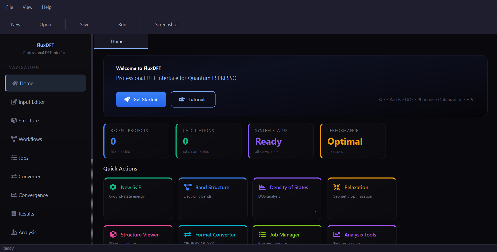

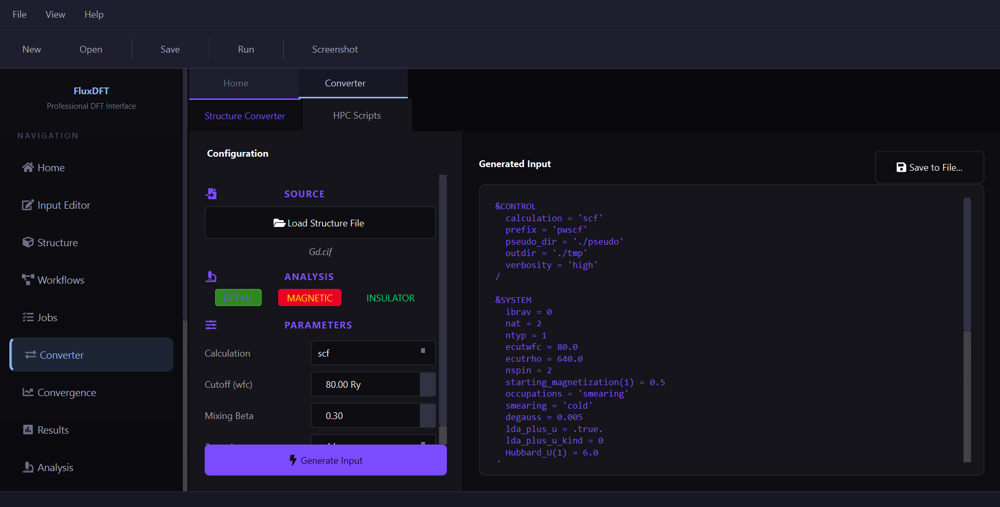

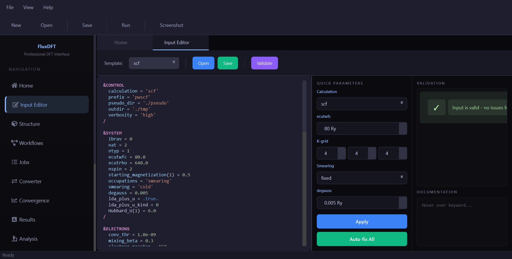

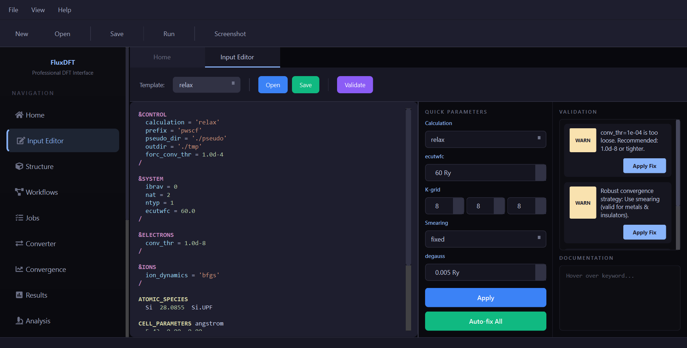

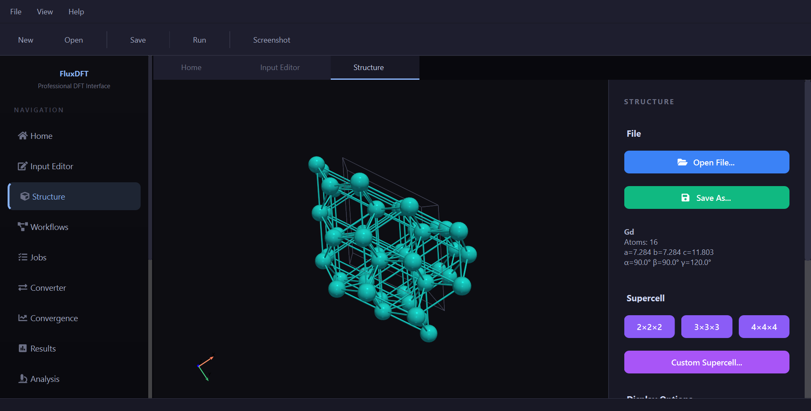

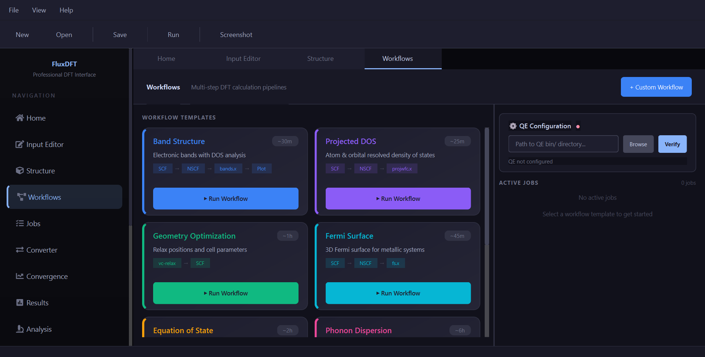

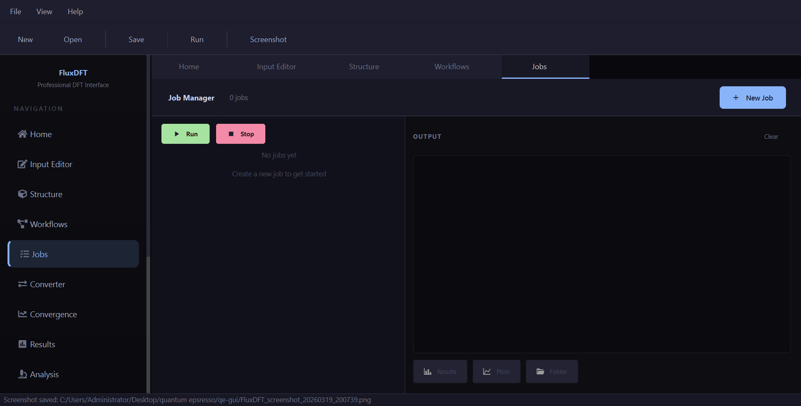

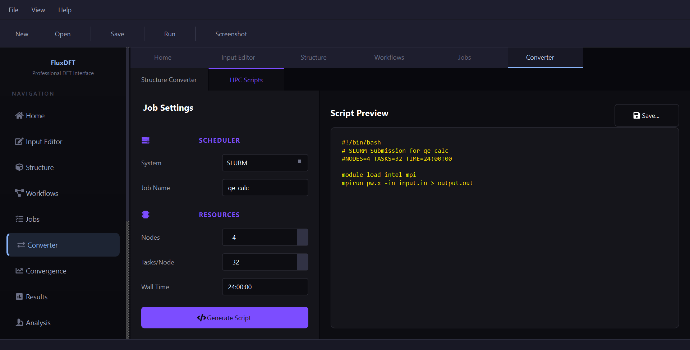

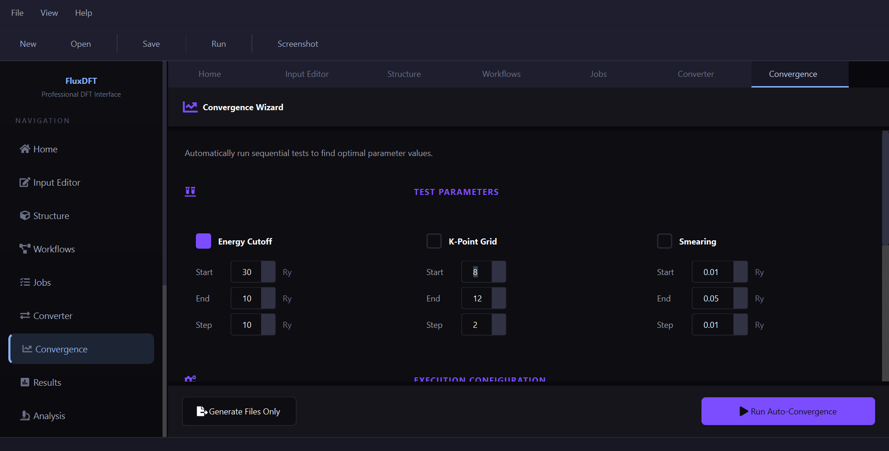

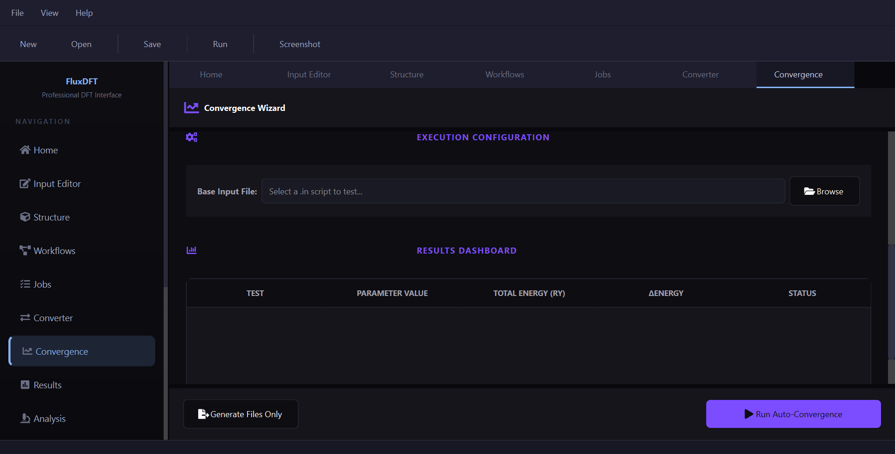

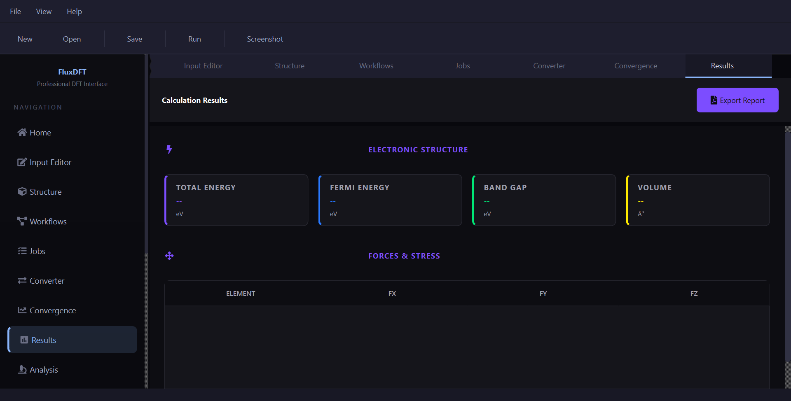

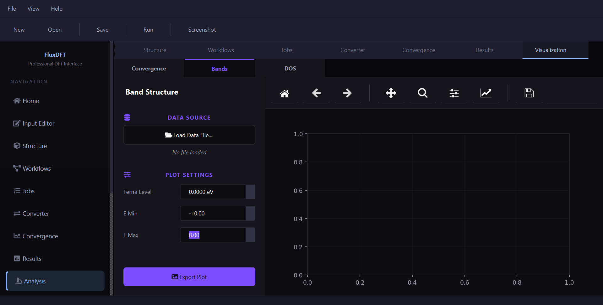

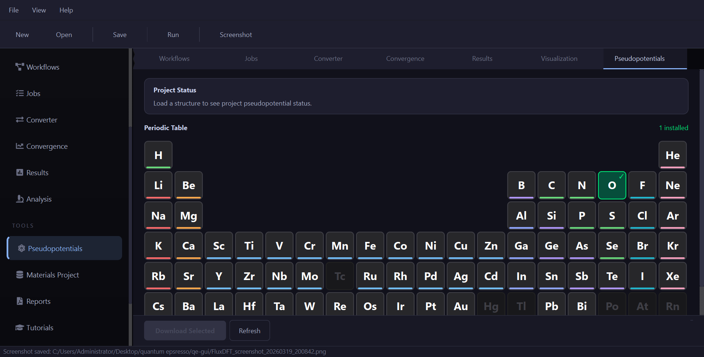

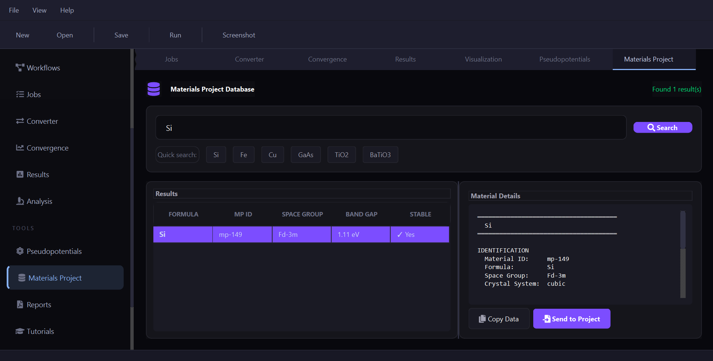

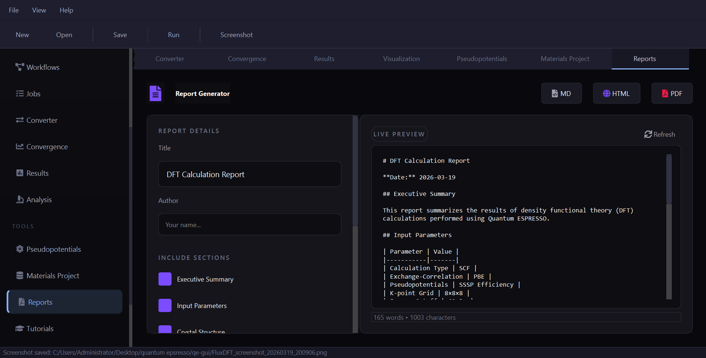

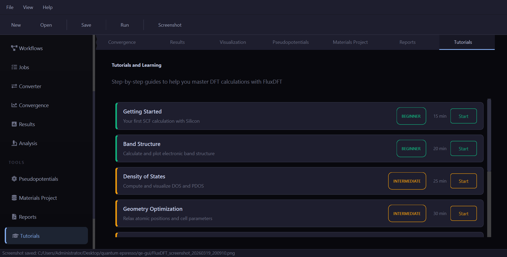
